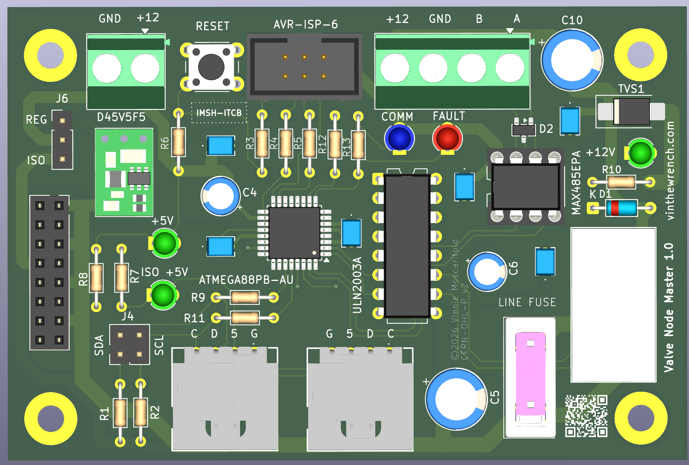
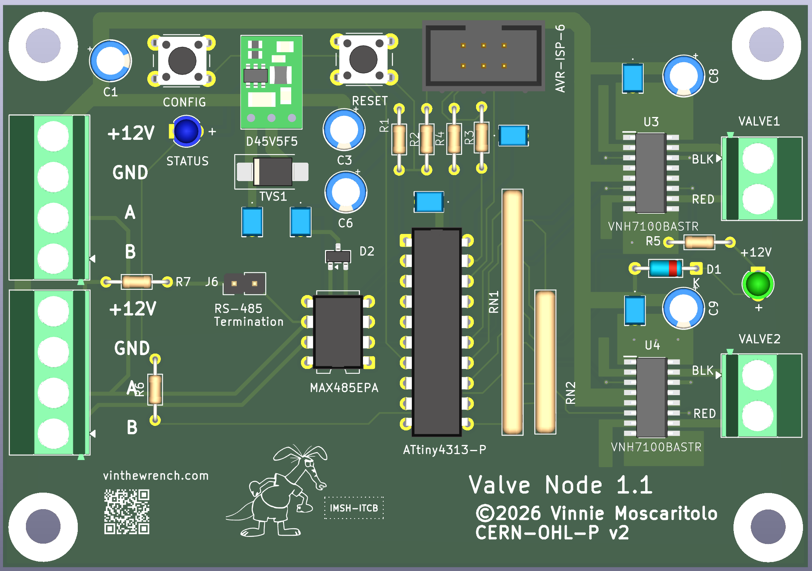
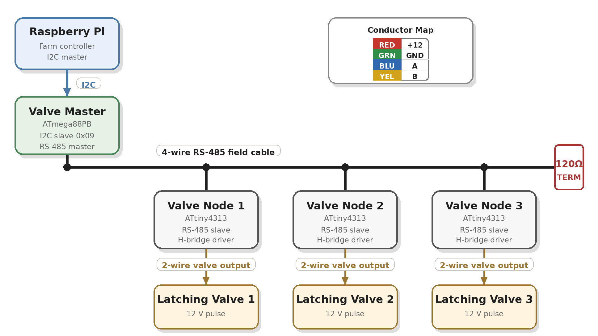

# ValveNode

# ValveNode

ValveNode is a wired field-bus irrigation valve-control system for my Raspberry Pi farm automation stack.

This project is a continuation of the work described in [Off-Grid Farm Automation with Raspberry Pi](https://www.vinthewrench.com/p/off-grid-farm-automation-raspberry-pi).

The irrigation side started with a Raspberry Pi, relay outputs, and conventional sprinkler valve wiring, described in [Raspberry Pi Internet of Things - part 2: Controlling the Irrigation valves](https://www.vinthewrench.com/p/raspberry-pi-internet-of-things-part-23c). That proved the basic idea: local software can control real irrigation hardware without a cloud service or proprietary controller. It also exposed the usual field problems: long wire runs, voltage drop, power loss, serviceability, and too many individual valve wires returning to one box.

I later experimented with more efficient solenoid drive hardware using a DRV103 in [Not Another Sprinkler Valve Article](https://www.vinthewrench.com/p/not-another-sprinkler-valve-article). That design gives a conventional valve a strong opening pulse and then reduces average power with PWM, which matters for long wire runs and battery-backed operation.

As the farm kept expanding, the wiring problem started to matter more than the valve-control problem. Every new irrigation zone meant another long wire run back to the controller, more trenching, more splices, more voltage drop, and more things to troubleshoot later. At that point, spending a few extra dollars per valve for latching solenoids was worth it if it let the field wiring become a simple 4-wire RS-485 network.

ValveNode takes the next step: instead of pulling every valve wire back to the controller, it moves small controller cards out into the field.

A Raspberry Pi talks to a Valve Master over I2C. The Valve Master starts a 4-wire RS-485 field cable carrying power and data. Valve Node cards sit along that cable, and each card drives a local latching irrigation solenoid with a short polarity-controlled pulse.

The goal is simple: irrigation control that is local, wired, understandable, repairable, and expandable.

## Overview

The project has two primary components:

- `valvenode-master`  
  ATmega88PB-based I2C-to-RS-485 master controller.
  
    

  
    

- `valvenode-slave`  
  ATtiny4313-based RS-485 valve node for controlling latching irrigation valves.
  

  

The upstream controller talks to the Valve Master over I2C. The Valve Master controls field power and communicates with downstream Valve Nodes over RS-485.

  

### Latching Solenoids

ValveNode is designed around low-voltage DC latching irrigation solenoids. The initial supported solenoids are:

| Manufacturer | Part | Description | Notes |
|---|---:|---|---|
| Hunter | [458200](https://www.hunterirrigation.com/irrigation-product/solenoids/458200) | DC latching solenoid | Common Hunter solenoid for battery-operated and DC-latching valve control |
| Rain Bird | [K80920](https://store.rainbird.com/tbospsol-tbos-potted-latching-solenoid.html) / TBOSPSOL | 9 V DC potted latching solenoid | Fits many Rain Bird valve bodies, including DV, DVF, ASVF, PGA, PEB, PESB, GB, EFB-CP, BPE, and BPES series valves |

A latching solenoid is not powered continuously. The Valve Node drives it with a short polarity-controlled pulse through the H-bridge: one polarity opens the valve, the opposite polarity closes it, and then the output is turned off.

## Project Goals

- Wired field-bus control for irrigation valves
- No cloud dependency
- No wireless dependency
- Local 12 V field-power switching
- Half-duplex RS-485 node communication
- AVR-based firmware that can be understood, built, and serviced
- KiCad hardware source included
- Separate master firmware, simulator, Linux test tool, and node firmware

## Repository Layout

~~~text
valvenode/
├── valvenode-master/
│   ├── docs/
│   ├── firmware/
│   ├── hw/
│   │   └── 1.0/
│   ├── sim/
│   └── test/
└── valvenode-slave/
    ├── docs/
    ├── firmware/
    ├── hw/
    │   ├── 1.0/
    │   └── 1.1/
    └── test/
~~~

## Valve Master

Path:

~~~text
valvenode-master/
~~~

The Valve Master is the central controller for the valve-node network.

It performs these jobs:

- Accepts host commands over I2C
- Controls switched 12 V field-bus power
- Sends RS-485 commands to downstream valve nodes
- Receives valve-node replies
- Maintains node discovery state
- Reports status and command results to the host
- Provides local visual status indication
- Exposes AVR ISP programming access

Default I2C address:

~~~text
0x09
~~~

Address `0x08` is reserved for a separate power-control board, so `0x09` is used as the default Valve Master address.

### Valve Master Hardware

Path:

~~~text
valvenode-master/hw/1.0/
~~~

Important KiCad source files:

~~~text
valvenode-master.kicad_pro
valvenode-master.kicad_sch
valvenode-master.kicad_pcb
~~~

The master board uses:

- ATmega88PB-AU
- MAX485-style RS-485 transceiver
- Relay-switched 12 V field-bus output
- FAULT input
- COMM and FAULT indicators
- AVR ISP header
- I2C host-side interface

### Valve Master Firmware

Path:

~~~text
valvenode-master/firmware/
~~~

Files:

~~~text
makefile
valvenode_master.c
~~~

The firmware implements the production Valve Master behavior:

- I2C slave interface
- Register map
- Deferred command handling
- RS-485 transmit/receive control
- Field-bus power control
- Node discovery
- Valve-node command dispatch
- Result and reply registers
- Fault/status reporting

Build:

~~~bash
cd valvenode-master/firmware
make
~~~

### Valve Master Simulator

Path:

~~~text
valvenode-master/sim/
~~~

Files:

~~~text
makefile
valvenode_master_sim.c
~~~

The simulator models the master command/register behavior for bench testing without hardware.

Build:

~~~bash
cd valvenode-master/sim
make
~~~

### Valve Master Linux Test Tool

Path:

~~~text
valvenode-master/test/
~~~

Files:

~~~text
makefile
Doxyfile
src/
~~~

Source files:

~~~text
I2C.cpp
I2C.hpp
LogMgr.cpp
LogMgr.hpp
TimeStamp.cpp
TimeStamp.hpp
Valve_master.cpp
Valve_master.hpp
main.cpp
~~~

The test tool is a Linux-side C++ program used to talk to the Valve Master over `/dev/i2c-*`.

The main C++ class is:

~~~text
Valve_master
~~~

It wraps the Valve Master I2C register map and command model.

Typical responsibilities:

- Open the Linux I2C device
- Select the Valve Master I2C address
- Read and write registers
- Submit commands
- Wait for command completion
- Read command results
- Read reply registers
- Read discovered node map
- Query firmware versions
- Control field power
- Ping nodes
- Set valve/channel state

Build:

~~~bash
cd valvenode-master/test
make
~~~

Generate local Doxygen docs:

~~~bash
cd valvenode-master/test
doxygen Doxyfile
open docs/html/index.html
~~~

## Valve Master I2C Register Model

The host talks to the master through a small register map.

Important registers include:

~~~text
REG_COMMAND
REG_STATUS
REG_ARG0
REG_ARG1
REG_ARG2
REG_RESULT
REG_POWER_STATE
REG_NODE_COUNT
REG_REPLY_NODE
REG_REPLY_CMD
REG_REPLY_ARG0
REG_REPLY_ARG1
REG_VERSION_HI
REG_VERSION_LO
REG_NODE_MAP
~~~

Important command values include:

~~~text
CMD_POWER_ON
CMD_POWER_OFF
CMD_WHO
CMD_PING
CMD_SET_CHANNEL
CMD_GET_CHANNEL_STATUS
CMD_GET_NODE_VERSION
CMD_IDENTIFY
CMD_CANCEL
CMD_CONFIG
CMD_ASSIGN
CMD_CLEAR_ERROR
CMD_SET_ERROR
~~~

Important status bits include:

~~~text
STATUS_BUSY
STATUS_ERROR
STATUS_POWER_ON
~~~

Important result values include:

~~~text
RESULT_OK
RESULT_BAD_COMMAND
RESULT_BAD_NODE
RESULT_BAD_CHANNEL
RESULT_NODE_NOT_FOUND
RESULT_UNSUPPORTED_CHANNEL
RESULT_CONFIG_REQUIRED
RESULT_ADDRESS_IN_USE
RESULT_BUSY
~~~

## Valve Node

Path:

~~~text
valvenode-slave/
~~~

The Valve Node is the remote field device. It receives RS-485 commands and drives a 12 V latching irrigation valve.

Core functions:

- Receive framed RS-485 commands
- Check destination address
- Respond to discovery and status commands
- Drive a latching valve using a polarity-controlled pulse
- Turn the H-bridge fully off after each pulse
- Report current logical valve state

### Valve Node Hardware

Paths:

~~~text
valvenode-slave/hw/1.0/
valvenode-slave/hw/1.1/
~~~

Important KiCad source files:

~~~text
valvenode.kicad_pro
valvenode.kicad_sch
valvenode.kicad_pcb
~~~

The `1.1` hardware directory is the newer active revision.

The node hardware uses:

- ATtiny4313
- 5 V RS-485 transceiver
- VNH7100BAS / VNH7100BASTR H-bridge
- 12 V latching irrigation valve output
- 12 V field-bus input
- Local 5 V regulator
- Optional status LED

Basic field connection:

~~~text
+12 V
GND
RS-485 A
RS-485 B
~~~

The design is intended for direct-burial irrigation cable.

Recommended cable:

- 18/4 acceptable for shorter runs
- 16/4 preferred for longer runs or higher node counts

### Valve Node Power Architecture

The node receives 12 V from the field cable.

Power paths:

- 12 V directly feeds the valve driver supply
- 12 V feeds a local 5 V regulator
- 5 V powers the ATtiny4313 and RS-485 transceiver

Recommended protection and stability parts include:

- Bidirectional TVS across the 12 V input
- Bulk capacitance near the H-bridge supply
- 0.1 uF local decoupling at MCU and transceiver
- Additional 5 V bulk capacitance near the MCU
- Reverse-polarity protection where practical

For master-side field power switching, allow roughly 250 to 300 ms after switching on the 12 V field bus before sending node commands.

### Valve Node Firmware

Path:

~~~text
valvenode-slave/firmware/
~~~

Files:

~~~text
makefile
valvenode.c
valvenode_example_commands.txt
~~~

The firmware target is the ATtiny4313.

Firmware responsibilities:

- UART receive
- RS-485 command parsing
- Address matching
- Optional checksum checking
- Valve open pulse
- Valve close pulse
- Status reporting
- Ping reply
- WHO discovery reply
- Safe H-bridge shutdown after each pulse

Build:

~~~bash
cd valvenode-slave/firmware
make
~~~

### Valve Node Test Tool

Path:

~~~text
valvenode-slave/test/
~~~

Files:

~~~text
makefile
src/main.cpp
~~~

The test tool is used for bench testing the valve-node command protocol.

Build:

~~~bash
cd valvenode-slave/test
make
~~~

## RS-485 Valve Node Protocol

The Valve Master and Valve Nodes communicate over a half-duplex RS-485 bus.

The node protocol is command/response. The master sends a framed command. A node replies only when addressed or when participating in a controlled discovery response.

Typical commands:

~~~text
PING
STATUS
OPEN
CLOSE
WHO
IDENTIFY
CONFIG
ASSIGN
VERSION
~~~

Typical behavior:

- `PING` confirms node presence
- `STATUS` reports logical valve/channel state
- `OPEN` sends the open-polarity valve pulse
- `CLOSE` sends the close-polarity valve pulse
- `WHO` is used for node discovery
- `IDENTIFY` asks a node to identify itself
- `CONFIG` enters configuration behavior
- `ASSIGN` sets or changes a node address
- `VERSION` reports firmware version

Broadcast state-changing commands should be avoided unless explicitly implemented and safe.

## Useful Linux I2C Commands

List I2C buses:

~~~bash
i2cdetect -l
ls -l /dev/i2c-*
~~~

Scan I2C bus 1:

~~~bash
i2cdetect -y 1
~~~

Look for the Valve Master at address `0x09`.

Check user permissions for I2C:

~~~bash
groups
ls -l /dev/i2c-*
~~~

If needed, add the user to the `i2c` group on Linux:

~~~bash
sudo usermod -aG i2c $USER
~~~

Then log out and back in.

## Development Notes

- The Valve Master default I2C address is `0x09`.
- The Valve Master controls field-bus 12 V power.
- The Valve Nodes are not autonomous irrigation controllers.
- Valve Nodes execute direct command/response behavior.
- Latching valves must be driven with short pulses, not continuous power.
- H-bridge outputs must be turned off after each pulse.
- RS-485 bus direction control must be handled carefully to avoid bus contention.
- Field wiring should assume noise, voltage drop, wet boxes, lightning exposure, and field-service abuse.

## Current Project Status

The repository currently contains:

- Valve Master hardware design
- Valve Master firmware
- Valve Master simulator
- Valve Master Linux I2C test program
- Valve Node hardware revisions
- Valve Node firmware
- Valve Node test program
- Protocol and design documentation
